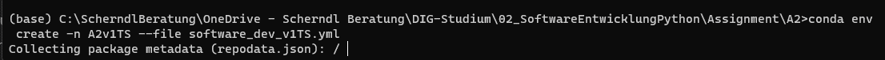
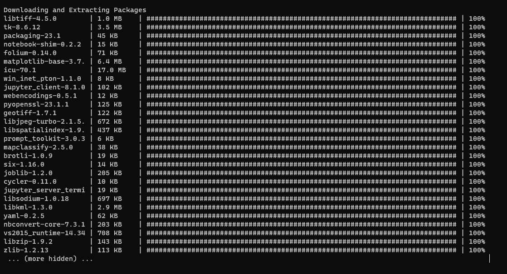
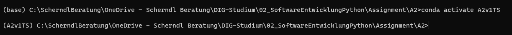
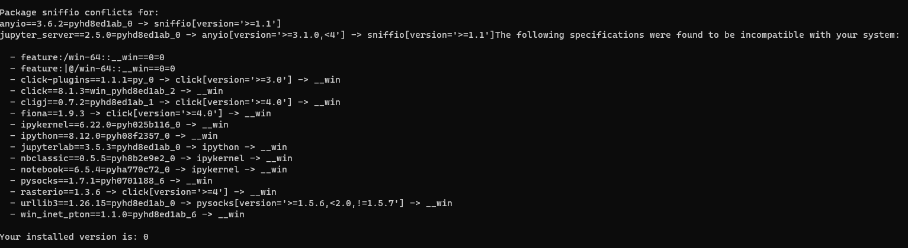

# A2 
*by Tom Scherndl*
*2023-05-02

* Step 1: Cloned the git repo locally  
* Step 2: used the terminal to navigate to the correct (local) folder
* Step 3: used the command to create a new environment by using: 

* Step 4: Waiting for solving/creating the environment

* Step 5: Activated the environment - the env is now visible in the command line 

* Step 6: I added the module psypog because we can always use database connections in a project, right? 
    * Step 6a: probably a mistake - having several conflicts and issues trying to install. Probably due to the fact that I am on Win11? I will abort that and start again by using the simpler environment. 
  

    * Step 6b: I updated geopandas as this does not seem to create issues. conda update -n A2v1TS geopandas

* Step 7: Finally, I exported the file using the following command: conda env export --from-history>A2v1TS.yml